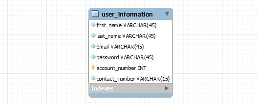

# Carpark Availability Checking System

## How to set up
1. Clone the repo
2. Have MySQL workbench running (No need to create the database, the code will do it, but please make sure there is no other database named 'carpark_availability' before starting the app, otherwise delete that database first)
3. run ```npm i``` to install dependencies
4. use ```npm run dev``` to run on localhost port 3000

## Paths

1. Sign up<br/>
    path: /signup<br/>
    type: POST<br/>
    body: firstName, lastName, email, password, contactNumber<br/>
    returns: JWToken<br/>

2. Sign in <br/>
    path: /signin<br/>
    type: POST<br/>
    body: email, password<br/>
    returns: JWToken<br/>

3. Delete Account<br/>
    path: /deleteaccount<br/>
    type: DELETE<br/>
    params: accountNumber<br/>

4. Member Details<br/>
    path: /memberdetails<br/>
    type: GET<br/>
    params: email<br/>
    JWT: Bearer Token in Header<br/>
    returns: JSON object with first name, last name and contact number<br/>

4. Carpark Availability<br/>
    path: /carparkavailability<br/>
    type: GET<br/>
    JWT: Bearer Token in Header<br/>
    description: API call to https://api.data.gov.sg/v1/transport/carpark-availability using current date and time<br/>
    returns: JSON from the inner API call as stated above<br/>

## Schema


